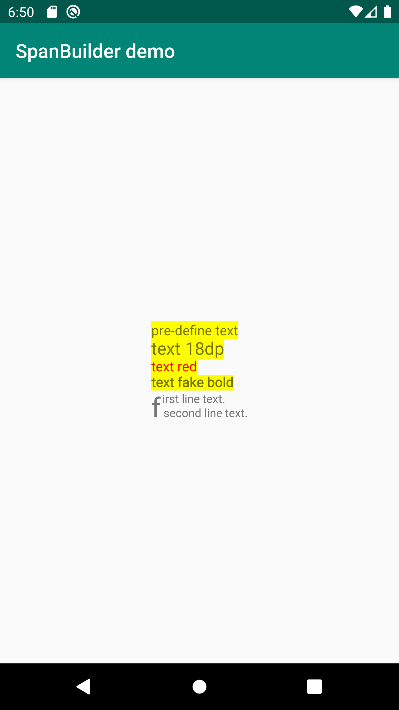

[  ](https://bintray.com/orab/repo/SpanBuilder/_latestVersion)

# SpanBuilder

A utils class for manipulating Android Spans without calculating index explicitly.

# Example

## Code

```kotlin
SpanBuilder.create("pre-define text\n")
    // Change previous part text size:
    .append("text 18dp\n").textSize(18, true)
    // Change previous part text color:
    .append("text red\n").textColor(Color.RED)
    // Apply fakeBold
    .append("text fake bold\n").fakeBold()
    // re-select range
    .all().backgroundColor(Color.YELLOW)
    // Leading letter effect
    // Add blank padding
    .padding(40).append("irst line text.\n").textSize((12 * factor).toInt())
    .append(
        SpanBuilder.create("f").textSize((28 * factor).toInt())
            .append(" second line text.").textSize((12 * factor).toInt())
            // Apply custom span
            .all().span(object : LineHeightSpan {

                override fun chooseHeight(
                    text: CharSequence?,
                    start: Int,
                    end: Int,
                    spanstartv: Int,
                    lineHeight: Int,
                    fm: Paint.FontMetricsInt?
                ) {
                    val paint = TextPaint()
                    paint.textSize = 12 * factor
                    paint.fontMetricsInt.let {
                        fm?.leading = it.leading
                        fm?.top = it.top
                        fm?.ascent = it.ascent
                        fm?.descent = it.descent
                        fm?.bottom = it.bottom
                    }
                }
            })
            .build()
    )
    .build()
```

## Screenshot


